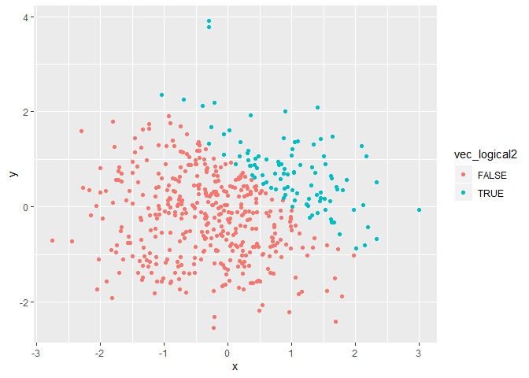
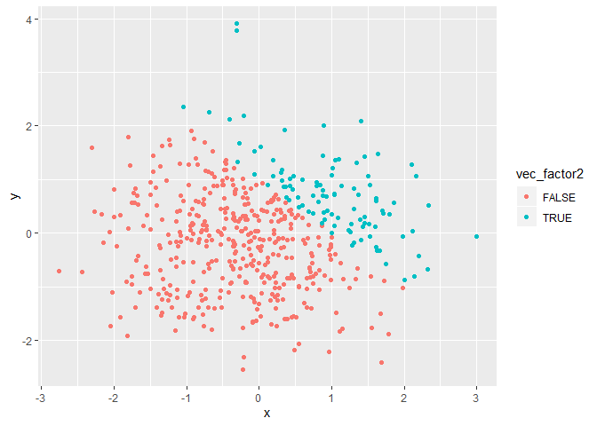
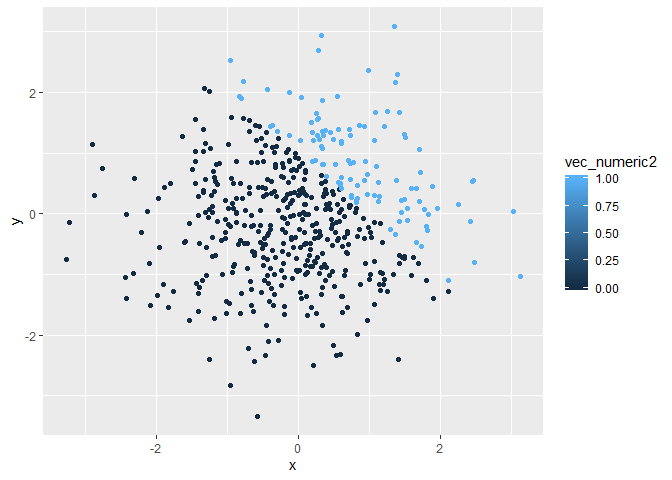

Homework 1
================

# Problem 1

Create a data frame and take means of each variable.

``` r
library(tidyverse)

vec_numeric = rnorm(8)
vec_logical = vec_numeric > 0
vec_char = c("1", "2", "3", "4", "5", "6", "7", "8")
vec_factor = factor(c("low", "high", "medium", "high",  "low", "medium", "high", "low"))

df = tibble(vec_numeric, vec_logical, vec_char, vec_factor)

mean(vec_numeric)
```

    ## [1] -0.08023357

``` r
mean(vec_logical)
```

    ## [1] 0.375

``` r
mean(vec_char)
```

    ## Warning in mean.default(vec_char): argument is not numeric or logical:
    ## returning NA

    ## [1] NA

``` r
mean(vec_factor)
```

    ## Warning in mean.default(vec_factor): argument is not numeric or logical:
    ## returning NA

    ## [1] NA

I can take the mean of *numeric* and *logical* variable but cannot do
this to *factor* and *character*.

``` r
as.numeric(vec_logical)
as.numeric(vec_char)
as.numeric(vec_factor)
```

`as.numeric` function transfers all the variables to
    numeric.??????

Calulation.

``` r
as.numeric(vec_logical) * vec_numeric
```

    ## [1] 0.00000000 0.00000000 0.00000000 3.19949095 0.00000000 0.00000000
    ## [7] 1.88009134 0.02954879

``` r
as.factor(vec_logical) * vec_numeric
```

    ## Warning in Ops.factor(as.factor(vec_logical), vec_numeric): '*' not
    ## meaningful for factors

    ## [1] NA NA NA NA NA NA NA NA

``` r
as.numeric(as.factor(vec_logical)) * vec_numeric
```

    ## [1] -1.13748530 -1.08583776 -0.92514227  6.39898190 -0.69838249 -1.90415182
    ## [7]  3.76018267  0.05909759

# Problem 2

``` r
x = rnorm(500)
y = rnorm(500)
vec_logical2 = x + y > 1
vec_numeric2 = as.numeric(vec_logical2)
vec_factor2 = as.factor(vec_logical2)

df2 = tibble(x, y, vec_logical2, vec_numeric2, vec_factor2)

df2
```

    ## # A tibble: 500 x 5
    ##          x      y vec_logical2 vec_numeric2 vec_factor2
    ##      <dbl>  <dbl> <lgl>               <dbl> <fct>      
    ##  1 -0.928  -0.965 FALSE                   0 FALSE      
    ##  2  0.336   1.37  TRUE                    1 TRUE       
    ##  3 -0.0697  0.599 FALSE                   0 FALSE      
    ##  4 -0.322   0.817 FALSE                   0 FALSE      
    ##  5  1.12    0.207 TRUE                    1 TRUE       
    ##  6 -1.26    2.03  FALSE                   0 FALSE      
    ##  7  0.631   0.244 FALSE                   0 FALSE      
    ##  8  1.58   -1.01  FALSE                   0 FALSE      
    ##  9 -0.325  -0.720 FALSE                   0 FALSE      
    ## 10  0.0909  0.716 FALSE                   0 FALSE      
    ## # ... with 490 more rows

A short description of my vector:

  - There are 500 rows and 5 columes.

  - The mean of x is -0.0181131. The median of x is 0.0151852. The
    standard deviation of x is 1.0004729.

  - The proportion of cases for which x+y\>1 is 0.218.

<!-- end list -->

``` r
ggplot(df2, aes(x = x, y = y, color = vec_logical2)) + geom_point()
```

<!-- -->

``` r
ggplot(df2, aes(x = x, y = y, color = vec_factor2)) + geom_point()
```

<!-- -->

``` r
ggplot(df2, aes(x = x, y = y, color = vec_numeric2)) + geom_point()
```

<!-- -->
